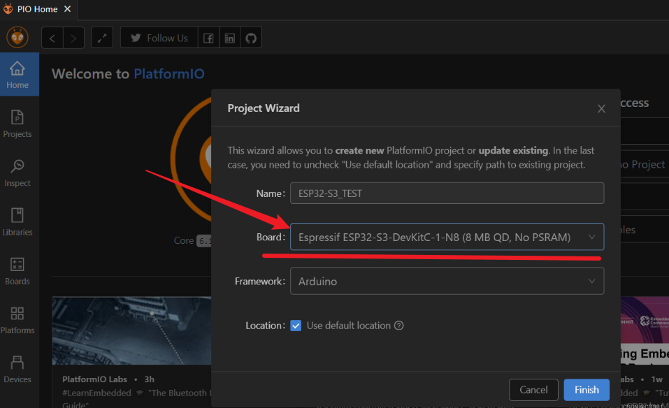
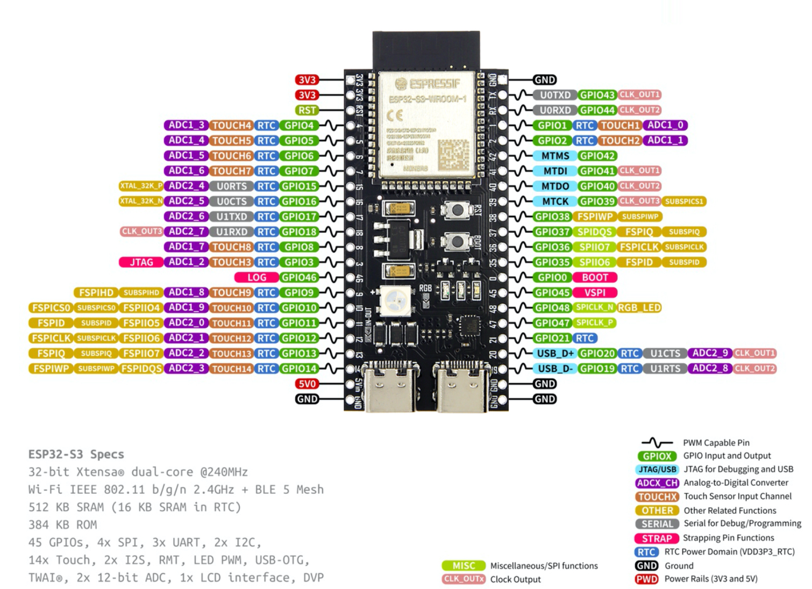
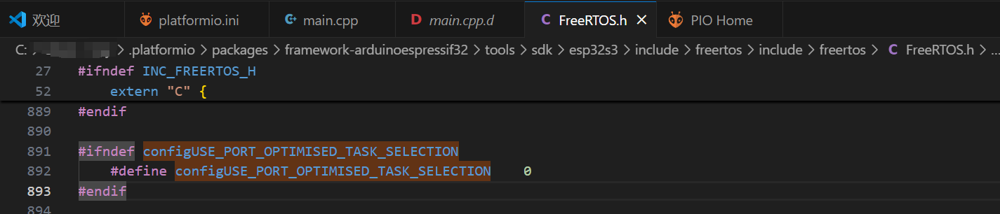

# ESP32-S3-N16R8 学习报告
---

## VSCode + PlatformIO + arduino 开发环境搭建
1. VSCode扩展库安装`PlatformIO IDE`
2. 新建工程，`Board`选择`esp32-s3-devkitc-1`作为开发板模型，第一次下载可能会比较慢
   
   (location可以改成自己的文件夹位置)
3. 将配置文件`platformio.ini`修改为如下代码：
    ``` ini
    [env:esp32-s3-devkitc-1]
    platform = espressif32
    board = esp32-s3-devkitc-1
    framework = arduino
    ; 指定为16MB的FLASH分区表
    board_build.arduino.partitions = default_16MB.csv
    ; 指定FLASH和PSRAM的运行模式
    board_build.arduino.memory_type = qio_opi
    ; 预定义宏，启用PSRAM
    build_flags = -DBOARD_HAS_PSRAM
    ; 指定FLASH容量为16MB
    board_upload.flash_size = 16MB
    ```
4. 文件夹结构：`lib`下可以放模块的.c文件，`src`下有`main.cpp`，可以开始编程了。

---

## ESP32-S3-N16R8 引脚定义


---

## 基础操作快速入门教程
[基于vscode的platformio对esp32的一点开发](https://www.cnblogs.com/shaochang123/articles/18638278)

---

## FreeRTOS
**ESP32 FreeRTOS是什么？**
ESP32 FreeRTOS是针对ESP32微控制器的一个实时操作系统（RTOS），它采用了FreeRTOS内核，可以帮助开发人员在ESP32芯片上进行多任务处理。简单来说，FreeRTOS提供了一种方式来管理软件任务并协调它们的执行。

教程一：[了解 ESP32 FreeRTOS：初学者指南](https://www.cnblogs.com/bruce1992/p/17856537.html)
教程二：[【FreeRTOS学习笔记】](https://zhuanlan.zhihu.com/p/717998097)

---

### 任务创建与多任务运行
创建两个任务并打印任务名称：完整代码
``` cpp
/*
如何创建freertos任务
如何分配内存、任务优先级
创建任务后loop循环还能不能使用
*/
#include <Arduino.h>
#include <freertos/FreeRTOS.h>
#include <freertos/task.h>


#if CONFIG_FREERTOS_UNICORE
#define ARDUINO_RUNNING_CORE 0
#else
#define ARDUINO_RUNNING_CORE 1
#endif

//创建任务函数
void Task1(void *pvParameters);
void Task2(void *pvParameters);


void setup() {
  // put your setup code here, to run once:
  Serial.begin(9600);  //波特率取决于你的数据线
  xTaskCreatePinnedToCore(
    Task1, "Task1"  // 任务名称
    ,
    1024  // 任务栈大小
    ,
    NULL  // 任务参数指针
    ,
    2  // 任务优先级大小 -- 值越小优先级越大
    ,
    NULL  // 任务句柄指针
    ,
    ARDUINO_RUNNING_CORE);  // 处理器核心编号


  xTaskCreatePinnedToCore(
    Task2, "Task2"  // 任务名称
    ,
    1024  // 任务栈大小
    ,
    NULL  // 任务参数指针
    ,
    1  // 任务优先级大小 -- 值越小优先级越大
    ,
    NULL  // 任务句柄指针
    ,
    ARDUINO_RUNNING_CORE);  // 处理器核心编号
}


void loop() {
  // 空闲？
  Serial.println("loop");
  delay(1000);
}


void Task1(void *pvParameters) {  // 任务1
  for (;;) {
    //
    Serial.println("task1");
    vTaskDelay(pdMS_TO_TICKS(1000));
    if (digitalRead(12) == HIGH) {
      Serial.println("GPIO12 is LOW. Deleting task...");
      vTaskDelete(NULL); // 删除当前任务
    }
  }
}


void Task2(void *pvParameters) {  // 任务2
  for (;;) {
    Serial.println("task2");
    vTaskDelay(pdMS_TO_TICKS(1000));
  }
}

```

**代码解析**
任务运行的 CPU 核心定义
``` cpp
#if CONFIG_FREERTOS_UNICORE
#define ARDUINO_RUNNING_CORE 0
#else
#define ARDUINO_RUNNING_CORE 1
#endif
```
ESP32 有双核处理器，CONFIG_FREERTOS_UNICORE 是编译配置选项
单核模式下任务运行在核心 0，双核模式下默认运行在核心 1

任务函数的声明
``` cpp
//创建任务函数
void Task1(void *pvParameters);
void Task2(void *pvParameters);
```
FreeRTOS 任务函数的标准原型是`void TaskFunction(void *pvParameters)`
pvParameters 是任务创建时传递的参数指针

xTaskCreatePinnedToCore ()创建任务
``` cpp
void setup() {
  Serial.begin(9600);
  
  xTaskCreatePinnedToCore(
    Task1, "Task1", 1024, NULL, 2, NULL, ARDUINO_RUNNING_CORE);
  
  xTaskCreatePinnedToCore(
    Task2, "Task2", 1024, NULL, 1, NULL, ARDUINO_RUNNING_CORE);
}
```
使用 xTaskCreatePinnedToCore () 创建两个任务：
- 参数 1：任务函数指针
- 参数 2：任务名称（主要用于调试）
- 参数 3：任务栈大小（单位：字，在 ESP32 上通常是 4 字节 / 字）
  - 任务栈大小：每个任务都有独立的栈空间，栈空间过小将导致栈溢出（通常表现为系统崩溃），1024 字（4KB）对于简单任务通常足够
- 参数 4：传递给任务的参数（这里用 NULL 表示不需要参数）
- 参数 5：任务优先级（2 比 1 高，**数字越小优先级越高！！** 与教程不同！）
> PlatformIO 默认配置：优先级数值越小，优先级越高。这与标准 FreeRTOS 相反！
 
 由FreeRTOS.h中的configUSE_PORT_OPTIMISED_TASK_SELECTION决定：
    若定义为1，数值越大优先级越高。
    若定义为0，优先级规则反转。
- 参数 6：任务句柄（这里用 NULL 表示不保存句柄）
- 参数 7：指定任务运行的 CPU 核心


> 创建任务函数：xTaskCreate函数和xTaskCreatePinnedToCore()函数的区别如下

| **特性**         | **xTaskCreate**                | **xTaskCreatePinnedToCore**    |
|------------------|--------------------------------|--------------------------------|
| 适用平台         | 所有 FreeRTOS 平台             | 仅 ESP - IDF（ESP32）          |
| 核心绑定         | 任务可以在任意核心上运行       | 可以绑定到指定核心（0 或 1）   |
| 多核支持         | 依赖调度器分配核心             | 显式指定核心                   |
| 灵活性           | 更通用，适合单核和多核系统     | 更适合需要核心绑定的场景       |
| 函数来源         | FreeRTOS 标准 API             | ESP - IDF 扩展 API             | 

Task1任务函数实现
``` cpp
void Task1(void *pvParameters) {
  for (;;) {
    Serial.println("task1");
    vTaskDelay(pdMS_TO_TICKS(1000));
    if (digitalRead(12) == HIGH) {
      Serial.println("GPIO12 is HIGH. Deleting task...");
      vTaskDelete(NULL);
    }
  }
}
```
Task1 任务函数的实现：
- for (;;)是 FreeRTOS 任务的典型无限循环结构
- 每秒打印一次 "task1" 
- 检查 GPIO12 引脚状态，如果为 HIGH 则删除当前任务
- vTaskDelete (NULL) 中的 NULL 表示删除当前任务

**vTaskDelay(pdMS_TO_TICKS(1000)); 的详细解析**
`vTaskDelay(pdMS_TO_TICKS(1000));` 是 FreeRTOS 中用于任务延时的核心 API，它的作用是让当前任务暂停执行一段时间，将 CPU 资源让给其他任务。下面详细解释其含义和工作原理：


**函数详解**
**`vTaskDelay()`**
- **功能**：将当前任务从运行状态切换到**阻塞状态**，持续指定的**时钟节拍数（Ticks）**。
- **参数**：延时的时钟节拍数（`TickType_t` 类型）。
- **返回值**：无（`void`）。

**`pdMS_TO_TICKS()`**
- **功能**：将毫秒（ms）转换为 FreeRTOS 的**时钟节拍数**。
- **参数**：需要转换的毫秒值（如 `1000` 表示 1 秒）。
- **原理**：根据 FreeRTOS 的**配置时钟频率**（通常由 `configTICK_RATE_HZ` 定义）进行换算，公式为：  
  `时钟节拍数 = 毫秒数 × (configTICK_RATE_HZ ÷ 1000)`  
  例如，若 `configTICK_RATE_HZ = 1000`，则 `pdMS_TO_TICKS(1000)` 等于 `1000` 个节拍。

**注意事项**
1. **延时精度**：  
   `vTaskDelay()` 的实际延时可能比指定时间多 **≤1 个节拍**，因为任务只能在**下一个时钟节拍到来时**被唤醒。例如，若 `configTICK_RATE_HZ = 100`（节拍周期 10ms），`vTaskDelay(pdMS_TO_TICKS(15))` 实际会延时 20ms（2 个节拍）。

2. **替代 API**：  
   - `vTaskDelayUntil()`：用于实现**周期性任务**，确保任务以固定频率执行（不受任务执行时间影响）。  
     示例：  
     ```cpp
     TickType_t xLastWakeTime = xTaskGetTickCount();
     const TickType_t xFrequency = pdMS_TO_TICKS(1000);
     
     for (;;) {
         vTaskDelayUntil(&xLastWakeTime, xFrequency);  // 每1秒执行一次
         // 任务代码
     }
     ```

3. **节拍频率配置**：  
   在 `FreeRTOSConfig.h` 中可修改 `configTICK_RATE_HZ`。较高的频率（如 1000Hz）提供更精确的延时，但会增加系统开销；较低的频率（如 100Hz）减少开销，但降低了时间精度。

---

### 给任务传递参数
#### 单个参数传递
同样是串口打印信息，给每个任务传递单个参数：
``` cpp
#include <Arduino.h>
#include <freertos/FreeRTOS.h>
#include <freertos/task.h>


#if CONFIG_FREERTOS_UNICORE
#define ARDUINO_RUNNING_CORE 0
#else
#define ARDUINO_RUNNING_CORE 1
#endif

int delaytime1 = 3000; //延时3秒
int delaytime2 = 7000; //延时7秒


//创建任务函数
void Task1(void *pvParameters);
void Task2(void *pvParameters);


void setup() {
  Serial.begin(9600);

  xTaskCreatePinnedToCore(Task1, "Task1", 1024, (void *)&delaytime1, 1, NULL, ARDUINO_RUNNING_CORE); //创建任务1
  xTaskCreatePinnedToCore(Task2, "Task2", 1024, (void *)&delaytime2, 1, NULL, ARDUINO_RUNNING_CORE); //创建任务2
}


void loop() {
}


void Task1(void *pvParameters) {  // 任务1
  int delaytime = *(int *)pvParameters; //获取参数
  
  for (;;) {
    Serial.println("task1");
    vTaskDelay(pdMS_TO_TICKS(delaytime));
  }
}


void Task2(void *pvParameters) {  // 任务2
  int delaytime = *(int *)pvParameters; //获取参数

  for (;;) {
    Serial.println("task2");
    vTaskDelay(pdMS_TO_TICKS(delaytime));
  }
}
```

#### 多个参数传递
同样是串口打印信息，这次通过结构体给每个任务传递多个参数：
``` cpp
#include <Arduino.h>
#include <freertos/FreeRTOS.h>
#include <freertos/task.h>

#if CONFIG_FREERTOS_UNICORE
#define ARDUINO_RUNNING_CORE 0
#else
#define ARDUINO_RUNNING_CORE 1
#endif

typedef struct {
  int delaytime;
  char message[20];  
} TaskData;

// 创建任务函数
void Task1(void *pvParameters);
void Task2(void *pvParameters);

// 静态分配任务数据，确保生命周期覆盖整个程序运行时间
static TaskData task1Data = {5000, "Hello"};
static TaskData task2Data = {13000, "Bye"};

void setup() {
  Serial.begin(9600);
  
  // 等待串口初始化完成
  while (!Serial);
  
  // 创建任务，传递静态数据的指针
  BaseType_t task1Created = xTaskCreatePinnedToCore(
    Task1, "Task1", 1024, &task1Data, 1, NULL, ARDUINO_RUNNING_CORE
  );
  
  if (task1Created != pdPASS) {
    Serial.println("Task1 creation failed");
  }
  
  BaseType_t task2Created = xTaskCreatePinnedToCore(
    Task2, "Task2", 1024, &task2Data, 1, NULL, ARDUINO_RUNNING_CORE
  );
  
  if (task2Created != pdPASS) {
    Serial.println("Task2 creation failed");
  }
}

void loop() {
  // 空循环，所有工作由 FreeRTOS 任务完成
}

void Task1(void *pvParameters) {
  TaskData *data = (TaskData *)pvParameters;
  
  for (;;) {
    Serial.print("Task1: ");
    Serial.println(data->message);
    vTaskDelay(pdMS_TO_TICKS(data->delaytime));
  }
}

void Task2(void *pvParameters) {
  TaskData *data = (TaskData *)pvParameters;
  
  for (;;) {
    Serial.print("Task2: ");
    Serial.println(data->message);
    vTaskDelay(pdMS_TO_TICKS(data->delaytime));
  }
}

```
**遇到的问题**
1. 刚开始我试图用`String`类型存储要打印的字符串信息，但是发现打印不出来。问题原因是`TaskData` 结构体在 `setup()` 函数的栈上创建，当 `setup() `执行完毕后，该内存可能被其他操作覆盖或释放。String 对象内部维护动态分配的内存，当原内存被释放后，任务中持有的 String 指针指向无效地址，导致打印乱码或无法显示。
> 解决方案:使用静态分配的 `char[]` 替代 `String` 类，确保参数内存安全：

2. 直接使用`print()`打印存在打印不出来的问题，改成`Serial.print()`或`Serial.println()`就好了

